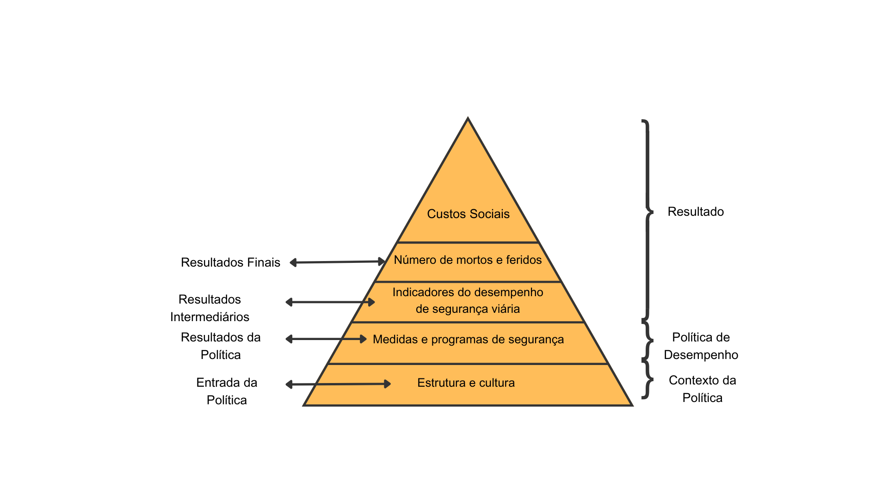

# Revisão de literatura {#sec-revbib}

Este capítulo apresenta a revisão de literatura com quatro principais seções. Primeiro, apresenta-se um histórico do Pnatrans (@sec-revbib-pnatrans), seguido do conteúdo sobre a definição e aplicações de indicadores de desempenho da segurança viária (@sec-revbib-concept) e de índices compostos de segurança viária (@sec-revbib-index). A @sec-revbib-est traz alguns estudos brasileiros que discutiram e aplicaram os conceitos de indicadores de desempenho.

## O Plano Nacional de Redução de Mortes e Lesões no Trânsito {#sec-revbib-pnatrans}

Em 2010, através de uma resolução da Assembleia Geral da Organização das Nações Unidas (ONU), foi proclamada a Década de Ação pela Segurança no Trânsito, com vigência entre 2011 e 2020. O principal objetivo foi convocar os países-membros a aplicar seus esforços em prol na melhoria nas condições de segurança viária, com o objetivo principal de reduzir a quantidade de óbitos e lesões no trânsito pela metade [@whoGlobalPlanDecade2010]. No Brasil, uma política pública à nível nacional foi concretizada apenas em 2018, com a aprovação da Lei 13.614 que cria o Plano Nacioanl de Mortes e Lesões no Trânsito - Pnatrans [@brasilCriaPlanoNacional2018].

O Pnatrans em sua versão inicial possuía o principal objetivo de reduzir a quantidade de óbitos e lesões no trânsito brasileiro em 50%, considerando o período entre 2019 e 2028. As metas de redução dos óbitos foram baseadas em taxas de óbitos por 10 mil veículos e por 100 mil habitantes; e estabelecidas para cada unidade da federação brasileira. Em seu lançamento, o plano de ações do Pnatrans possuía 8 pilares e outras quantidade de ações e produtos, que acabaram sendo ajustados em futuras versões [@brasilCriaPlanoNacional2018].

Visto que o desafio global de melhorar as condições da segurança no trânsito ainda precisa ser enfrentado, a Assembleia Geral da ONU declarou a Segunda Década de Ação pela Segurança no Trânsito em 2020, mantendo os mesmo objetivos principais para o período entre 2021 e 2030 [@whoGlobalPlanDecade2021a]. Neste contexto, foi elaborada a primeira revisão do Pnatrans com a publicação da Resolução CONTRAN (Conselho Nacional de Trânsito) nº 870/2021. O plano de ações desta nova versão do Pnatrans se alinha com as abordagens do Sistema Seguro e Visão Zero e é estruturado a partir dos seguintes pilares [@contranRESOLUCAOCONTRANNo2021]:

-   I - Gestão da Segurança no Trânsito;

-   II - Vias Seguras;

-   III - Segurança Veicular;

-   IV - Educação para o Trânsito;

-   V - Atendimento às Vítimas; e

-   VI - Normatização e Fiscalização.

Ao fim de 2023 houve mais uma revisão do Pnatrans, com a publicação da Resolução CONTRAN nº 1.004. A primeira modificação feita no plano é a remoção do índice de óbitos por 10 mil veículos como indicador da meta de redução, mantendo apenas o índice de óbitos por 100 mil habitantes. Outra modificação foi a extensão do prazo de cumprimento do plano, passando de 2028 para 2030 e alinhando-se com o fim da Segunda Década. A meta de redução que antes era estabelecida para o Brasil e para os estados também foi estabelecida para os municípios. Em relação aos pilares, houve apenas uma mudança no nome e no escopo geral do Pilar V, que foi modificado para "Vigilância, Promoção da Saúde e Atendimento às Vítimas no Trânsito" [@contranRESOLUCAOCONTRANNo2023].

## Indicadores de desempenho da segurança viária {#sec-revbib-concept}

Os **Indicadores de Desempenho da Segurança Viária**, ou *Safety Performance Index* (SPI) são medidas utilizadas para avaliar as condições de segurança de um sistema de transporte. Eles são fundamentais para uma abordagem preventiva em relação a segurança viária, uma vez que apenas o número de mortes ou sinistros de trânsito não oferece uma compreensão completa sobre como e por que esses sinistros ocorrem. Ao criar indicadores de desempenho e monitorá-los de forma periódica é possível identificar as falhas de segurança antes que elas causem mortes ou ferimentos mais graves [@santosPlanoNacionalReducao2023].

A @fig-piramide apresenta a posição dos indicadores de desempenho da segurança viária em relação aos diferentes níveis de desempenho da segurança viária. Na base, tem-se como a estrutura e cultura de um local está correlacionado diretamente com as políticas voltadas para a segurança no trânsito. Em um segundo nível, tem-se como resultado a criação de medidas e políticas públicas para a segurança. Em seguida, mede-se o resultado intermediário dessas políticas por indicadores em diferentes áreas de fator de risco (*e.g.* infraestrutura, comportamento, segurança veicular, etc.). O resultado que busca se evitar é a ocorrência de óbitos e lesões no trânsito. Por fim, no último nível da pirâmide têm-se os custos que a sinistralidade no trânsito causa à sociedade [@borszczINDICADORESDESEMPENHOSEGURANCA2023a; @Wegman2008a].

::: {#fig-piramide}

Fonte: Adaptado de @Wegman2008a

Hierarquia de indicadores e metas da segurança viária
:::

O estabelecimento de indicadores de desempenho da segurança viária não só permite o monitoramento mas também o exercício de *benchmarking* entre diferentes locais ou entidades. @santosPlanoNacionalReducao2023 utilizaram indicadores de desempenho da segurança viária para estabelecer um processo de *benchmarking* entre municípios brasileiros com o objetivo final de estabelecer metas de redução de óbitos no trânsito.

Outra iniciativa europeia é o PIN - *The Road Safety Performance Index*, comentado anteriormente no @sec-intro, cujo objetivo é comparar o desempenho entre os países-membros da União Europeia, premiando o melhor desempenho anualmente [@etscPINRoadSafety2024]. O PIN inclui áreas como comportamento de usuários, infraestrutura viária e segurança veicular. Atualmente, o programa tem 32 países participando; em que 27 são países-membros da União Europeia, em conjunto com Israel, Noruega, Sérvia, Suíça e Reino Unido.

## Índices compostos de segurança viária {#sec-revbib-index}

A natureza multidisciplinar da segurança viária exige que os tomadores de decisão considerem diversos fatores contribuintes ao seu desempenho. Vários desses fatores podem ser combinados por meio de um índice composto que tem sido cada vez mais utilizado em comparações internacionais entre países. A precisão de um índice composto não depende apenas da seleção de indicadores, criação de de pesos o métodos de agregação, mas também na correlação destes índices com a ocorrência e gravidade dos sinistros de trânsito [@tesicIdentifyingMostSignificant2018]. 

Como definição, tem-se os SPIs que são as medidas que refletem as condições operacionais de um sistema que influenciam o desempenho da mobilidade segura. A combinação de SPIs em um índice composto resulta na criação de um **Índice Composto de Segurança Viária**, ou *Road Safety Performance Index* (RSPI), que é uma medida que reflete o desempenho da segurança viária de uma localidade [@tesicIdentifyingMostSignificant2018]. 

Ao construir um RSPI, @tesicIdentifyingMostSignificant2018 recomendam que não só a quantidade de SPIs é importante, mas também a correlação desses SPIs com os indicadores de resultado, incluindo óbitos, feridos e sinistros. Também é crucial que os SPIs apontem para o mesmo lado da escala, ou seja, todos eles devem ter a mesma direção na relação com os indicadores de resultado.

Para @Wegman2008a, a criação de um RSPI podem trazer vantagens e desvantagens na avaliação de desempenho da segurança viária. Entre as vantagens, tem-se as seguintes considerações:

- Podem resumir realidades complexas com o objetivo de apoiar os tomadores de decisão;
- São mais fáceis de interpretar do que uma grande quantidade de SPIs separados;
- Facilitam a comunicação com o público em geral (ou seja, cidadãos, mídia, etc.)
- Permitem a comparação de dimensões complexas de forma eficaz.

Como desvantagens, os autores apontam que a criação de RSPIs:

- Podem passar uma mensagem incorreta se forem mal construídos ou interpretados;
- Podem levar a conclusões simplistas;
- Podem ser mal utilizados se o processo de construção não for transparente e/ou carecer de princípios estatísticos ou conceituais sólidos;
- Podem disfarçar falhas graves em algumas dimensões e aumentar a dificuldade de identificar a ação corretiva adequada, se o processo de construção não for transparente;
- Podem levar a políticas inadequadas se dimensões de desempenho que são difíceis de medir forem ignoradas.

Alguns profissionais tendem a evitar a criação de índices compostos, pois sentem que o extenso trabalho de coleta e processamento de dados é “desperdiçado” ou “ocultado” atrás de um único número de relevância questionável. Entretanto, para *stakeholders*, existe uma importante vantagem em resumir processos complexos em uma única medida para comparar o desempenho da segurança viária de diferentes locais [@Wegman2008a].

@elvikDevelopmentRoadSafety2024 lista as características mais importantes de um RSPI:

- **Abrangência**: Refere-se à inclusão de várias medidas de segurança viária, garantindo que diferentes aspectos do sistema viário sejam refletidos no índice.
- **Flexibilidade**: A capacidade de o índice ser ajustado ao longo do tempo com novos dados ou medidas relevantes, permitindo sua evolução com mudanças nas políticas de segurança.
- **Sensibilidade**: O índice deve ser capaz de refletir mudanças significativas na segurança viária, de modo que qualquer melhoria ou deterioração seja claramente capturada.
- **Decomponibilidade**: O índice deve ser capaz de ser desmembrado em seus componentes principais e SPIs originais, permitindo uma análise detalhada de cada um dos fatores que o compõem.

@Wegman2008a também listam as características e os processos mais importantes para se considerar na elaboração de um RSPI:

- **Normalização** ou **padronização**: os indicadores utilizados devem ser comparáveis, ou seja, seguir uma escala similar para que possam ser combinados de forma adequada;
- **Agregação ponderada**: utilizar técnicas para combinar valores numéricos de diferentes escalas;
- **Relação com outras variáveis**: os índices compostos devem ter uma correlação com os indicadores originais e/ou outros indicadores já estabelecidos na área da segurança viária;
- **Transformação para os dados originais**: os índices compostos devem ser transparentes e permitir a decomposição para os indicadores originais.

No projeto SUNFlowerNext, @Wegman2008a elaboraram um *benchmark* de segurança viária entre 27 países da União Europeia. Esse processo incluiu a criação de um RSPI com base em 4 grupos de indicadores: (i) desempenho das políticas de segurança viária; (ii) indicadores de resultado; (iii) indicadores de desempenho da segurança viária - SPIs; e (iv) características locais e socioeconômicas. Os autores aplicaram a metodologia de Análise de Componentes Principais (ACP), com o principal objetivo de criar componentes principais que agregam a maior quantidade possível de variação dos valores originais com a menor quantidade possível de componentes. O índice composto foi criado com base na soma ponderada das componentes principais obtidas, em que o peso é definido pela variância de cada componente principal. O projeto incluiu a aplicação da ACP considerando cada grupo de indicadores de forma separada e outra aplicação para todos os indicadores de forma única.

Conforme descrito em @sec-method, o Projeto IRIS adotará uma abordagem semelhante ao projeto SUNFlowerNext, com a aplicação da ACP para cada Pilar de indicadores, a fim de criar um índice composto para cada grupo.

## Estudos brasileiros {#sec-revbib-est}

No Brasil, estudos prévios criaram indicadores de desempenho com o intuito de aprimorar o processo de diagnóstico da segurança viária e a comparação entre diversas localidades. @bastosRoadSafetyStrategic2014 apresentou um diagnóstico da situação da segurança viária ao nível estadual, seguido do estabelecimento de metas para reduzir o número de mortes no trânsito e sugestão para melhorias com base em uma avaliação de indicadores do desempenho da segurança viária relacionados aos usuários da via, ambiente e veículos. Nesse estudo, as unidades federativas foram agrupadas em três *clusters* para comparações e foram aplicadas técnicas de *Data Envelopment Analysis (DEA)* e *bootstrapping,* considerando a sensibilidade dos resultados e possíveis variações dos dados de entrada. Como resultado, foram obtidos diagnósticos da segurança viária por estado, avaliações desagregadas para diferentes tipos de veículos e principalmente foram traçadas metas para redução de mortes no trânsito.

Já na escala municipal, @santosPlanoNacionalReducao2023 elaboraram um processo de *benchmarking* e metas de redução de óbitos com base em 13 indicadores, divididos em três categorias: resultado final, resultado intermediário e indicadores socioeconômicos. Através na Análise de Componentes Principais (PCA) foi possível criar índices compostos para cada categoria. Em seguida, através do método de *k-means* foi possível criar *clusters* de municípios com características similares de segurança e desenvolvimento. Em cada grupo foi feito um processo de *benchmarking* que possibilitou criar metas de redução de óbitos no trânsito para cada município.

Considerando um grupo reduzido de municípios, @torresMETODOLOGIABENCHMARKPARA2023 estruturaram uma base de dados de indicadores de desempenho de segurança viária para cidades brasileiras com mais de 100 mil habitantes. Além disso, desenvolveram um indicador que integra as dimensões dos sistemas seguros, permitindo análises de *benchmarking* em relação ao índice de óbitos no trânsito no nível municipal. Cidades foram agrupadas com base em seus indicadores socioeconômicos, identificando padrões e semelhanças entre elas. Essa abordagem proporcionou uma visão abrangente do desempenho das políticas de segurança viária.

Utilizando o plano de ações do Pnatrans como base, @borszczINDICADORESDESEMPENHOSEGURANCA2023a estabeleceram 24 indicadores de desempenho, classificados conforme os seis pilares do Pnatrans, para cada unidade da federação brasileira. Com esses indicadores elaborados, os autores fizeram análises de correlação com a taxa de óbitos por 10 mil veículos, buscando investigar os efeitos no resultado final em cada estado.