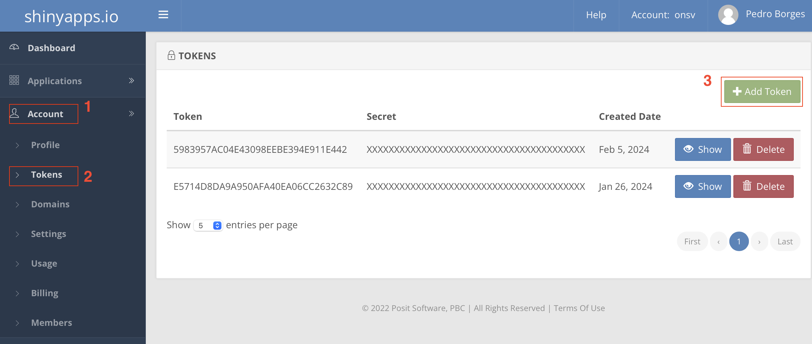
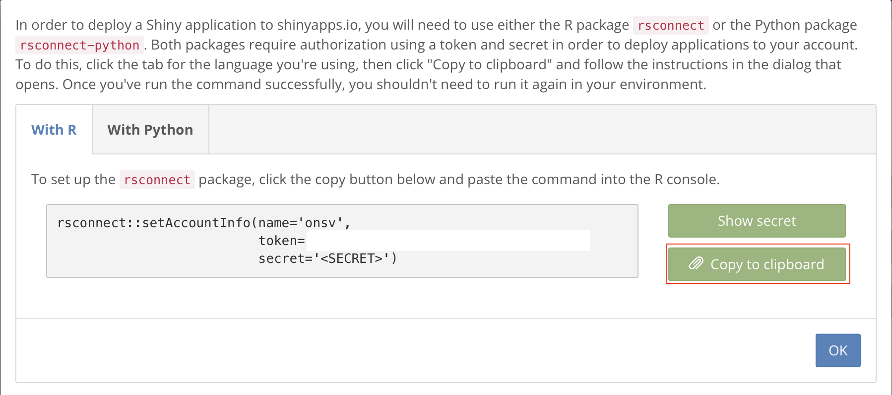
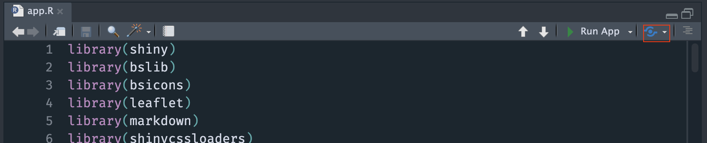
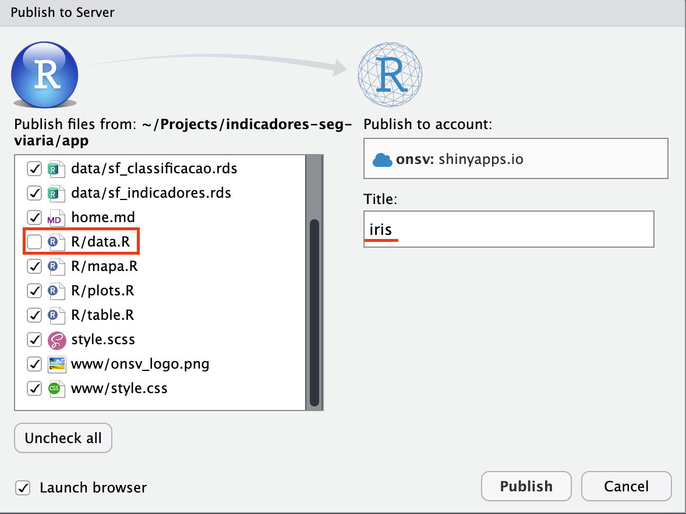

# Publicação {#sec-publicacao}

O presente capítulo apresenta as instruções dos últimos passos do projeto - a publicação dos *outputs* de todo o código.

## Arquivos dos relatórios {#sec-publicacao-relatorios}

Os projetos do Quarto Markdown inseridos na pasta report geram dois arquivos de saída dentro da pasta report/[entrega]/docs: o mesmo relatório no format PDF e DOCX. O meio de publicação destes arquivos fica a critério do usuário.

## Publicação do dashboard {#sec-publicacao-dashboard}

O dashboard foi hospedado com o shinyapps^[https://shinyapps.io/] - uma plataforma específica para realizar o deploy de aplicativos desenvolvidos com o `{shiny}`.  Para isso, é necessário a instalação do pacote `{rsconnect}` (já instalado ao executar `renv::restore()`) e a utilização da IDE RStudio^[É possível realizar o deploy sem o RStudio, porém deixa o processo um pouco mais demorado.].

O primeiro passo consiste em fazer o login na plataforma com as seguintes credenciais:

> login: `pedro.borges@onsv.org.br`

> senha: `Onsv@2024`

Em seguida, é necessário gerar um token para conectar o seu ambiente de trabalho com a conta no shinyapps. Para isso, com o login efetuado, acesse o menu Account -> Tokens -> Add Token, conforme indicado na @fig-passo01.

{#fig-passo01}

Com o token gerado, clique para ver o seu conteúdo e depois clique em "Copy to clipboard", para copiar o comando (@fig-passo02). Em seguida, cole esse comando no console do RStudio e execute-o. Agora o seu RStudio está conectado com o shinyapps.

{#fig-passo02}

Para publicar o dashboard, é necessário clicar no botão "Publish", ao lado de "Run App", conforme indicado na @fig-passo03.

{#fig-passo03}

Ao clicar em "Publish", uma tela similar ao da @fig-passo04 irá abrir. Aqui é importante selecionar todos os arquivos, com exceção de R/data.R. Em seguida, mude o título para "iris" e utilize o botão "Publish" para executar a publicação do dashboard.

{#fig-passo04}

Apos clicar em "Publish", o processo será executado. Geralmente é um processo um pouco demorado e é importante que ele não seja interrompido.